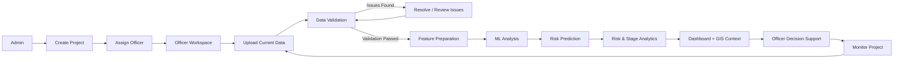
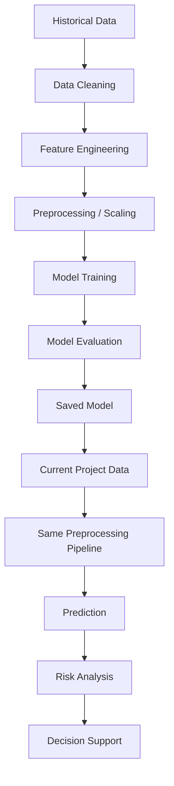
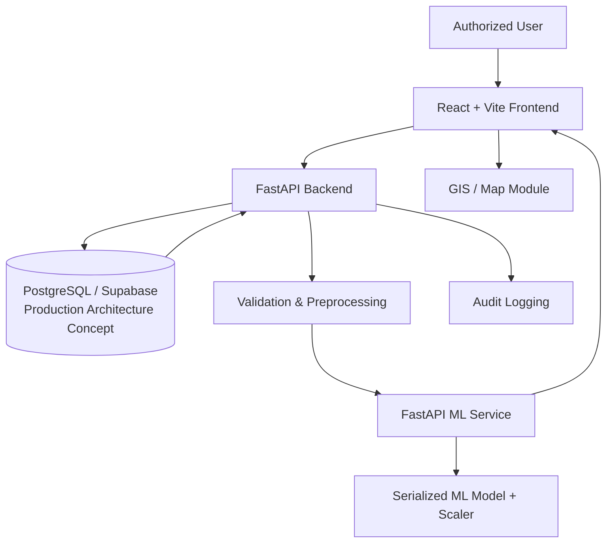

<div align="center">


# 🌱 BhoomiDrishti

### AI/ML-Powered Land Acquisition Decision-Support Platform

**Smart India Hackathon 2026 · Problem Statement SIH26017**

[](#)
[](#)
[](#)
[](#)
[](#)

**Turning land-acquisition data into earlier, clearer risk signals for authorized officers.**

</div>

---

## 📌 Problem Statement

Land acquisition is a complex government process involving multiple stages, stakeholders, landowners, documentation, compensation, rehabilitation and administrative approvals.

A large amount of land and project-related information has to be managed throughout this process. Potential problems may involve incomplete records, verification issues, compensation-related information, legal-field status or other project conditions. In many workflows, the impact of these issues becomes visible only after they have already affected the project timeline.

### The core question

> **How can available historical and current land-acquisition data be used to identify potential delay risks early and help authorized officers take timely action?**

BhoomiDrishti is designed as a **decision-support system**. It does not replace government officers, legal procedures or administrative authorities.

---

## 🌱 What is BhoomiDrishti?

**BhoomiDrishti** is an AI/ML-powered land-acquisition monitoring and decision-support platform that combines:

- 📊 Land and project data
- ✅ Data validation
- 🧹 Data preparation and preprocessing
- 🤖 Machine-learning analysis
- ⚠️ Risk-oriented prediction
- 📈 Dashboards and analytics
- 🗺️ Geographic/GIS context
- 🔐 Role-based administrative access concepts
- 🧾 Audit-oriented workflow

The key idea is to add an **intelligence layer** to the land-acquisition workflow rather than building only a record-management application.

```text
DATA
  ↓
VALIDATION
  ↓
FEATURE EXTRACTION
  ↓
ML ANALYSIS
  ↓
RISK PREDICTION
  ↓
EXPLANATION / ANALYSIS
  ↓
DECISION SUPPORT
  ↓
MONITORING
```

---

## 🎯 Objective

The project aims to shift land-acquisition monitoring from a primarily reactive workflow toward a more proactive one:

```text
Traditional approach
Record → Store → Monitor

BhoomiDrishti approach
Record → Validate → Analyze → Predict → Prioritize → Act → Monitor
```

The system helps an authorized officer understand **which projects or records may require additional attention** based on available data and learned patterns.

---

## 👥 User Roles

### 👨‍💼 Admin

The Admin manages the overall project workflow.

- Create a land-acquisition project
- Enter project information
- Assign a project to an officer
- Publish/manage project information
- Monitor project information
- Perform administrative operations
- Access audit-oriented information

### 🧑‍💼 Land Acquisition Officer

The Officer works with assigned projects.

- View assigned projects
- View project information
- Upload current project/landowner data
- Validate uploaded datasets
- Resolve validation issues
- Run analysis after validation
- View ML-based risk information
- Review charts and analytics
- Review GIS/location information
- Monitor project status

> **Scope:** The prototype is focused on authorized administrative users. Citizen-facing functionality is not the primary focus of this prototype.

---

## ✨ Key Features

| Feature | Purpose |
|---|---|
| 📁 Project Management | Create, manage, assign and monitor land-acquisition projects |
| 👤 Role-based Access | Separate administrative and officer-oriented workflows |
| 📤 Data Upload | Bring current project/landowner data into the workflow |
| ✅ Data Validation | Detect missing, duplicate, invalid or inconsistent information before analysis |
| 🧠 ML Risk Analysis | Generate a risk-oriented prediction from processed project data |
| 📊 Risk Dashboard | View project risk, indicators, trends and analytical summaries |
| 🗺️ GIS Module | Provide geographic context for land-acquisition projects |
| 📈 Stage Analytics | View stage-related predictions and project lifecycle information |
| 🔔 Notifications | Surface relevant system/project alerts in the interface |
| 🧾 Audit Trail | Maintain an audit-oriented record of important project actions |
| 🔐 Security Concepts | Authentication, MFA/TOTP concepts, authorization and controlled access |
| 📑 Sample Data | Excel/CSV-style sample datasets for prototype demonstration |

---

## 🔄 Complete System Workflow



### Why the validation gate matters

Raw data is **not intended to go directly into the ML workflow**. The prototype includes a validation-oriented stage so that data-quality issues can be identified before downstream analysis.

```text
Uploaded Data
     ↓
Validation
     ↓
Cleaning / Preprocessing
     ↓
Feature Preparation
     ↓
ML Model
     ↓
Risk Analysis
```

---

## 🤖 Machine Learning Pipeline

The ML component learns patterns from historical/project datasets and uses those patterns to estimate potential delay risk for current project records.



### ML principle

The prediction is a **risk signal**, not a guarantee.

The quality of predictions depends on the quality, representativeness and availability of historical data. The final administrative or legal decision remains with the authorized officer.

### ML service in this repository

The repository contains a dedicated `ml_service/` with:

- FastAPI-based ML service
- Saved trained model
- Saved model feature metadata
- Feature scaler
- Prediction endpoint/service logic
- Python ML dependencies

The repository currently includes serialized model artifacts such as:

```text
ml_service/
├── bhoomidrishti_improved_model.pkl
├── bhoomidrishti_model_features.pkl
└── feature_scaler.pkl
```

---

## 🗺️ GIS / Geographic Context

Land acquisition is inherently connected to geography. BhoomiDrishti therefore includes a GIS-oriented workflow to provide location context for projects.

The prototype includes a map/location module where project boundaries or locations can be represented and reviewed.

A production deployment could connect this workflow to authorized government GIS or mapping data, subject to the appropriate access controls and data-sharing policies.

---

## 📊 Dashboard & Analytics

The interface is designed around operational visibility rather than simply displaying raw records.

The project includes UI modules for areas such as:

- Project overview
- Project management
- Data validation
- ML predictions
- Risk distribution
- Risk trends
- Stage-delay analysis
- Project lifecycle/stage information
- GIS/location selection
- Notifications
- Administration
- Audit logs

### Suggested repository screenshots

> **Tip for the GitHub repository:** Add real screenshots from the running prototype under `docs/screenshots/` and replace the placeholders below. This will make the repository immediately more visual for judges, recruiters and visitors.

```text
docs/
└── screenshots/
    ├── admin-dashboard.png
    ├── officer-workspace.png
    ├── data-validation.png
    ├── ml-predictions.png
    └── gis-map.png
```

Then display them in this section using:

```md


```

---

## 🏛️ Government & Legal Context

Land acquisition is a legally sensitive government process. The project concept is developed with awareness of the **Right to Fair Compensation and Transparency in Land Acquisition, Rehabilitation and Resettlement Act, 2013 (RFCTLARR Act)**.

BhoomiDrishti is **not intended to replace**:

- The RFCTLARR Act
- Government procedures
- Legal authorities
- Administrative approvals
- Authorized government officers

The platform is intended to provide an additional **data-analysis and decision-support layer**.

---

## 🔐 Security & Access-Control Concept

Land and landowner information may be sensitive. The project therefore incorporates security-oriented architectural concepts such as:

- Authentication
- Role-based authorization
- Multi-factor authentication/TOTP concepts
- Controlled project access
- Secure backend API design
- Row-Level Security concepts
- Audit logging
- Session/expiry controls

For a production deployment, these controls would need to be implemented and audited against the actual government's security, infrastructure and compliance requirements.

---

## 🧪 Dataset

The project works with two broad categories of data:

### 1. Historical Data

Used to support ML training and pattern discovery.

### 2. Current Project Data

Uploaded by an authorized officer and processed through the validation and preprocessing pipeline before prediction.

The repository includes prototype/sample Excel datasets, including files related to:

- Land parcels
- Affected families
- Compensation
- Legal field status
- BhoomiDrishti project data

### Why synthetic/sample data?

Real government land-acquisition datasets are restricted and cannot simply be exposed in a public hackathon repository. Therefore, the prototype uses realistic sample/synthetic data for demonstration and ML development.

> **Important:** Sample data should not be interpreted as real government records.

---

## 🧰 Technology Stack

### Frontend

- **React 19**
- **Vite**
- **TypeScript / TSX**
- **Tailwind CSS**
- **Lucide React**

### Backend

- **Python**
- **FastAPI**
- **Uvicorn**
- **OpenPyXL**
- **python-multipart**

### Machine Learning Service

- **Python**
- **FastAPI**
- **Pandas**
- **NumPy**
- **Scikit-learn**
- **Joblib**
- **OpenPyXL**

### Data

- Excel (`.xlsx`)
- CSV-style datasets
- Historical/sample project data
- Serialized ML model artifacts

---

## 🏗️ Architecture



> **Architecture note:** The repository contains the React frontend, Python backend and ML service. PostgreSQL/Supabase, Row-Level Security and other hardened infrastructure elements are part of the intended production architecture/security concept and should not be interpreted as proof of a deployed government database.

---

## 📁 Project Structure

```text
BhoomiDrishti/
│
├── src/
│   ├── components/
│   │   ├── data-validation/
│   │   ├── ml-predictions/
│   │   └── project-management/
│   ├── assets/
│   ├── data/
│   ├── services/
│   ├── types/
│   ├── App.tsx
│   └── main.tsx
│
├── backend/
│   ├── main.py
│   ├── requirements.txt
│   └── readme.md
│
├── ml_service/
│   ├── main.py
│   ├── requirements.txt
│   ├── bhoomidrishti_improved_model.pkl
│   ├── bhoomidrishti_model_features.pkl
│   └── feature_scaler.pkl
│
├── data/
│   └── BhoomiDrishti_Dataset.xlsx
│
├── Affected_Families.xlsx
├── Compensation.xlsx
├── Land_Parcels.xlsx
├── Legal_Field_Status.xlsx
├── package.json
├── package-lock.json
├── .env.example
├── PROTOTYPE_INTEGRATION.md
└── README.md
```

---

## ⚙️ Installation & Setup

### Prerequisites

Make sure the following are installed:

- Node.js and npm
- Python 3.x
- pip
- Git

### 1. Clone the repository

```bash
git clone <YOUR_GITHUB_REPOSITORY_URL>
cd BhoomiDrishti
```

### 2. Install frontend dependencies

```bash
npm install
```

### 3. Install backend dependencies

```bash
cd backend
python -m pip install -r requirements.txt
cd ..
```

### 4. Install ML service dependencies

```bash
cd ml_service
python -m pip install -r requirements.txt
cd ..
```

### 5. Configure environment variables

Create the local environment file from the example provided in the repository:

```bash
cp .env.example .env
```

On Windows PowerShell, you can use:

```powershell
Copy-Item .env.example .env
```

Review the values before running the application.

---

## ▶️ How to Run

### Frontend

From the project root:

```bash
npm run dev
```

The Vite configuration starts the development server on port `3000`.

### Backend

From the `backend/` directory:

```bash
uvicorn main:app --reload
```

### ML Service

From the `ml_service/` directory:

```bash
uvicorn main:app --reload
```

> Run the backend and ML service in separate terminals. Use the API/service configuration expected by the frontend environment.

### Production build check

```bash
npm run build
```

TypeScript validation:

```bash
npm run lint
```

---

## 🔌 Backend / API Layer

The repository includes a FastAPI backend in `backend/main.py` and a separate FastAPI-based ML service in `ml_service/main.py`.

The separation provides a clean conceptual boundary:

```text
Frontend
   │
   ▼
Backend API
   │
   ├── Project / data workflow
   ├── Validation workflow
   └── ML service integration
              │
              ▼
        ML Prediction Service
              │
              ▼
       Model + Preprocessing
```

For detailed backend information, see [`backend/readme.md`](backend/readme.md).

For ML-service information, see [`ml_service/README.md`](ml_service/README.md).

---

## 🧠 Implemented Prototype vs Future Scope

### Implemented / represented in the repository

The current repository contains the prototype implementation for:

- React/Vite administrative interface
- Admin and officer-oriented workflows
- Project creation and management UI
- Officer project workspace
- Dataset upload workflow
- Data validation workflow
- ML prediction workflow/UI
- Risk and stage analytics components
- GIS/location components
- Notifications UI
- Audit-oriented components
- Authentication/MFA-related UI components
- FastAPI backend
- Dedicated FastAPI ML service
- Serialized ML model artifacts
- Prototype/sample datasets

### Future / production enhancements

The following are proposed extensions rather than claims of a production government deployment:

- Integration with authorized government databases
- Authorized government APIs
- Real-time project updates
- Automated alerts and notifications
- Advanced GIS analysis
- More explainable AI capabilities
- Stage-wise delay prediction improvements
- Automated report generation
- Multi-district deployment
- Multi-state deployment
- Continuous model retraining
- Historical trend analysis at larger scale
- Advanced audit/compliance controls
- Production-grade identity, infrastructure and security hardening

---

## 🌍 Real-World Use Case

Imagine an authority is handling multiple land-acquisition projects, each containing a large number of records.

Instead of manually reviewing every record to identify possible problems:

```text
1. Project is created
        ↓
2. Officer receives assignment
        ↓
3. Current data is uploaded
        ↓
4. Dataset is validated
        ↓
5. ML processes relevant features
        ↓
6. Risk information is generated
        ↓
7. Dashboard highlights important information
        ↓
8. Officer prioritizes attention
        ↓
9. Project continues to be monitored
```

BhoomiDrishti therefore acts as an **analytical assistant for authorized officers**, rather than an automated legal decision-maker.

---

## 💡 Why Machine Learning?

A normal dashboard can answer:

> **“What is happening?”**

A predictive layer can additionally help explore:

> **“What may require attention?”**

When project data becomes large, historical patterns may be difficult to identify manually. Machine learning can provide an additional risk signal that helps an officer prioritize investigation and monitoring.

That is why BhoomiDrishti combines:

```text
DATA STORAGE
     +
DATA ANALYTICS
     +
MACHINE LEARNING
     +
VISUALIZATION
     +
GIS CONTEXT
     ↓
DECISION SUPPORT
```

---

## 🚧 Limitations

The prototype does **not** claim to predict every real-world land-acquisition delay with certainty.

Key limitations include:

1. ML performance depends on historical data quality and representativeness.
2. Real government datasets are restricted and therefore are not exposed in this repository.
3. Prototype/sample data cannot fully represent every real-world administrative scenario.
4. Predictions are risk signals and not legal or administrative decisions.
5. A real deployment would require government-approved infrastructure, security, data governance and validation.

---

## 🚀 Future Scope

BhoomiDrishti can evolve toward a larger government decision-support ecosystem with:

- 🏛️ Authorized government database integration
- 🔗 Secure government APIs
- ⚡ Real-time project updates
- 🔔 Automated risk alerts
- 🗺️ Advanced GIS analysis
- 🧠 Explainable AI
- 📅 Stage-wise delay prediction
- 📄 Automated reports
- 🌐 Multi-district and multi-state deployment
- 🔄 Continuous model retraining
- 📊 Long-term historical trend analysis
- 👥 Role-specific analytics
- 🧾 Advanced audit and compliance features

---

## 📈 Expected Impact

The long-term vision is to help authorities move from:

> **“Finding problems after they happen”**

towards:

> **“Identifying potential risks before they become critical.”**

The system combines government-process awareness with data, machine learning, analytics, GIS and decision support to create a foundation for more proactive land-acquisition monitoring.

---

## 🏆 Smart India Hackathon Context

| Item | Details |
|---|---|
| Hackathon | Smart India Hackathon 2026 |
| Problem Statement | SIH26017 |
| Domain | Government Technology / Land Acquisition / ML / Data Analytics / GIS |
| Project | BhoomiDrishti |
| Primary Users | Admin and Land Acquisition Officer |
| Core Approach | Validate → Analyze → Predict → Explain → Monitor |

---

## 📚 Additional Documentation

- [`PROTOTYPE_INTEGRATION.md`](PROTOTYPE_INTEGRATION.md) — prototype integration notes
- [`backend/readme.md`](backend/readme.md) — backend details
- [`ml_service/README.md`](ml_service/README.md) — ML service details

---


## ⚖️ Disclaimer

BhoomiDrishti is a **hackathon/prototype decision-support system**. It is not a replacement for government officers, statutory procedures, legal authorities, official records or legally binding decisions.

Any future production deployment should use only authorized data and infrastructure and should undergo appropriate security, legal, administrative and model-validation review.

---

<div align="center">

### 🌱 BhoomiDrishti

**From land-acquisition data to proactive decision support.**

*Built for Smart India Hackathon 2026 *

</div>
